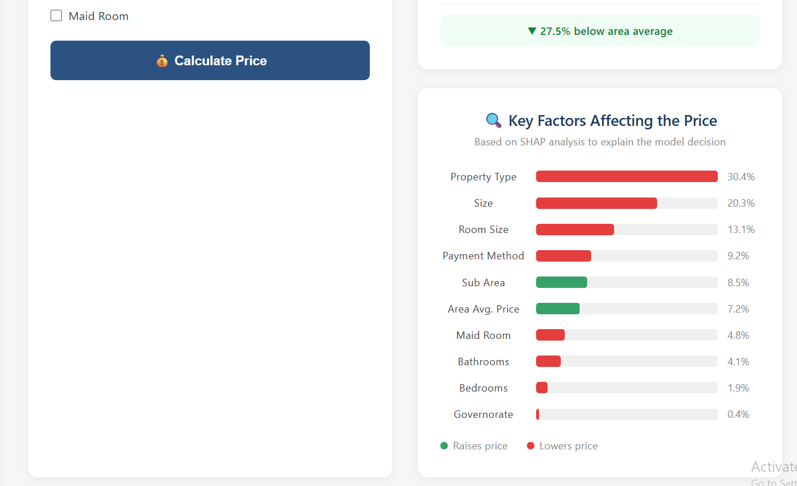
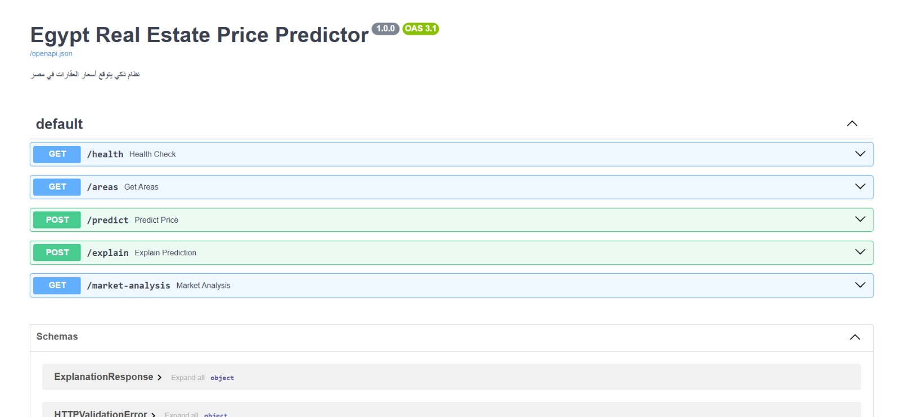

# 🏠 Egypt Real Estate Price Predictor

> An intelligent full-stack ML system that predicts real estate prices across Egypt based on 19,000+ real market listings — with SHAP explainability, FastAPI backend, and a bilingual React frontend.


---

## 📸 Screenshots

### Light Mode (Arabic)


### Dark Mode (English)


### SHAP Explainability


### API Documentation


---

## 🎯 What Makes This Project Different

Most real estate price predictors just give you a number. This system:

- ✅ **Explains WHY** — SHAP values show which factors (location, size, type) drove the prediction
- ✅ **Real Market Data** — 19,321 cleaned listings from Property Finder Egypt
- ✅ **Price Range** — not just one number, but a confidence interval
- ✅ **Market Comparison** — compare your property vs. area average price/m²
- ✅ **Bilingual UI** — full Arabic (RTL) and English (LTR) support
- ✅ **Dark / Light Mode** — persisted across sessions

---

## 🧱 Tech Stack

| Layer | Technology |
|---|---|
| Data | 19,321 real listings from Property Finder Egypt |
| ML Model | XGBoost (R² = 0.74, MAE ≈ 4.9M EGP) |
| Hyperparameter Tuning | Optuna (50 trials) |
| Explainability | SHAP via XGBoost native `pred_contribs` |
| Backend | FastAPI + Uvicorn |
| Frontend | React + Vite |
| Styling | CSS3 with CSS Variables (Dark/Light themes) |
| Language | Arabic/English toggle with RTL/LTR support |

---

## 📊 Model Performance

| Metric | Value |
|---|---|
| R² Score | **0.74** |
| MAE | **~4.9M EGP** |
| Training samples | 15,456 |
| Test samples | 3,865 |
| Hyperparameter tuning | Optuna (50 trials, 3-fold CV) |

**Top features by SHAP importance:**
1. Area price per m² (target-encoded) — 36.8%
2. Property type — 20.4%
3. Size (m²) — 11.1%

---

## 🚀 API Endpoints

```
GET  /health           → Health check
GET  /areas            → List of governorates, areas, property types
POST /predict          → Predict price with confidence range
POST /explain          → SHAP explanation of prediction
GET  /market-analysis  → Market stats for a given area
```

### Example Request

```bash
curl -X POST http://localhost:8000/predict \
  -H "Content-Type: application/json" \
  -d '{
    "governorate": "Cairo",
    "sub_area": "5th Settlement Compounds",
    "property_type": "Apartment",
    "payment_method": "Cash",
    "size_sqm": 150,
    "bedrooms": 3,
    "bathrooms": 2,
    "has_maid_room": false
  }'
```

### Example Response

```json
{
  "predicted_price": 7167548.0,
  "price_range_low": 5877389.0,
  "price_range_high": 8457706.0,
  "confidence": 0.74,
  "area_avg_price_per_sqm": 65909.0,
  "price_per_sqm_input": 47784.0,
  "comparison_to_area_avg_pct": -27.5
}
```

---

## 🗂️ Project Structure

```
egypt-real-estate-predictor/
│
├── 📁 src/
│   ├── main.py              ← FastAPI app + CORS + endpoints
│   ├── predictor.py         ← Model loading + prediction + SHAP
│   └── schemas.py           ← Pydantic request/response models
│
├── 📁 models/
│   ├── model.ubj            ← Trained XGBoost model (binary JSON)
│   ├── encoders.pkl         ← LabelEncoders for categorical features
│   ├── feature_names.json   ← Feature order for inference
│   ├── area_price_per_sqm.json  ← Target-encoded area prices
│   ├── global_median_pps.json   ← Fallback for unknown areas
│   ├── known_areas.json     ← Sub-areas for frontend dropdowns
│   ├── known_governorates.json
│   └── known_types.json
│
├── 📁 frontend/
│   └── src/
│       ├── App.jsx           ← Main app with theme + language state
│       ├── App.css           ← CSS variables for dark/light themes
│       ├── translations.js   ← Arabic + English strings
│       └── components/
│           ├── PredictionForm.jsx
│           ├── PriceResult.jsx
│           └── ShapChart.jsx
│
├── requirements.txt
└── README.md
```

---

## ⚙️ Local Setup

### 1. Clone the repo

```bash
git clone https://github.com/marwa698/egypt-real-estate-predictor.git
cd egypt-real-estate-predictor
```

### 2. Backend setup

```bash
# Create and activate virtual environment
python -m venv venv
.\venv\Scripts\Activate.ps1   # Windows
source venv/bin/activate       # Mac/Linux

# Install dependencies
pip install -r requirements.txt

# Run the backend
uvicorn src.main:app --reload
# → http://localhost:8000
# → http://localhost:8000/docs  (Swagger UI)
```

### 3. Frontend setup

```bash
cd frontend
npm install
npm run dev
# → http://localhost:5173
```

---

## 🔑 Key Technical Decisions

**Why XGBoost over Deep Learning?**
Tabular data with ~19K rows benefits more from gradient boosting than neural networks. XGBoost also natively supports SHAP values via `pred_contribs`, which was essential for explainability.

**Why Target Encoding for Location?**
Simple label encoding loses geographic price information. By encoding each sub-area as its median price/m², the model learns real estate market values — the single strongest predictor (36.8% SHAP importance).

**Why ubj format for the model?**
XGBoost's binary JSON (`.ubj`) format is version-independent and more reliable than pickle for cross-environment deployment.

**Why native SHAP via pred_contribs?**
Avoids dependency conflicts between the `shap` library and XGBoost 3.x, while producing identical results.

---

## 👤 Author

**Marwa Yosry** — ML Engineer & Full-Stack Developer

- GitHub: [@marwa698](https://github.com/marwa698)
- Trained on Harvard & Amazon ML courses

---

## 📄 License

MIT License — feel free to use, modify, and distribute.
